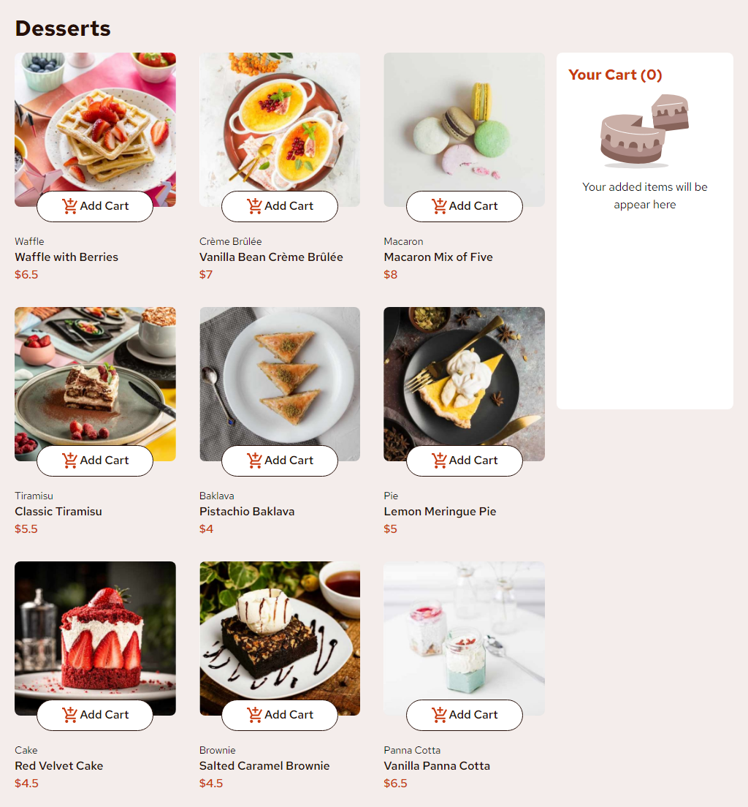

# Frontend Mentor - Product list with cart solution

This is a solution to the [Product list with cart challenge on Frontend Mentor](https://www.frontendmentor.io/challenges/product-list-with-cart-5MmqLVAp_d). Frontend Mentor challenges help you improve your coding skills by building realistic projects.

## Table of contents

- [Overview](#overview)
  - [The challenge](#the-challenge)
  - [Screenshot](#screenshot)
  - [Links](#links)
- [My process](#my-process)
  - [Built with](#built-with)
  - [What I learned](#what-i-learned)
  - [Continued development](#continued-development)
- [Author](#author)

## Overview

### The challenge

Users should be able to:

- Add items to the cart and remove them
- Increase/decrease the number of items in the cart
- See an order confirmation modal when they click "Confirm Order"
- Reset their selections when they click "Start New Order"
- View the optimal layout for the interface depending on their device's screen size
- See hover and focus states for all interactive elements on the page

### Screenshot



### Links

- Solution URL: [Add solution URL here](https://your-solution-url.com)
- Live Site URL: [Add live site URL here](https://peaceful-chebakia-a4cbc5.netlify.app/)

## My process

### Built with

- Semantic HTML5 markup
- Tailwind
- Flexbox
- CSS Grid
- Mobile-first workflow
- [React](https://reactjs.org/) - JS library
- [Vite](https://vitejs.dev/) - React framework
- [Redux](https://redux.js.org/) - Redux

### What I learned

I just start to learn Redux and i learned some basics about him

## What is Redux

Redux is a state centralizer that stores all the states of your
application in one place so you can reuse it anywhere you want. This
is usefull when you want to avoid **props drilling**.

**props drilling** happens when you have to pass props to component
to component until you reach your target component who will use
indeed those props. Something you want to avoid because your code
may become dirty and painfull to maintain.

### How to create a store

After you install Redux dependencies in your project, if you don't know
you can find [here](https://redux.js.org/introduction/getting-started),
you have to configure your store, where all your states will be. To do this you have to import `createStore` from redux toolkit

```jsx
import { configureStore } from "@reduxjs/toolkit";

export default configureStore({
	reducer: {},
});
```

After configure you have to wrap your main component your `<App/>` with the provider from `react-redux` and pass the store your configurated as a prop like this:

```jsx
<Provider store={store}>
	<App />
</Provider>
```

Done this you have the basic from Redux configurated

### Actions

With your tiny configuration we can now configure your slices. Slices are
where we will set a initial value for your state and configure what actions can be made to alter this state.

We make a slices with `createSlice` from redux toolkit.

This is code where i configured my slice for the `<Cart/>` component
note that `createSlice` accepts a object where we define your initial states and reducers that are actually your actions.

```jsx
import { createSlice } from "@reduxjs/toolkit";

const cartSlice = createSlice({
	name: "cart",
	initialState: {
		value: {
			products: [],
		},
	},
	reducers: {
		add: (state, action) => {
			state.value.products.push(action.payload);
		},
		incrementProductQuantity: (state, action) => {
			state.value.products = state.value.products.map((product) => {
				return product.name === action.payload.name
					? { ...product, quantity: ++product.quantity }
					: product;
			});
		},
    ...
```

### How we have acess to your state

We can have acess to your state by using `useSelector` from redux toolkit.

In this code i am acessing the state from the slice and defining if
the cart is empty or not and setting the total quantity of products there are in your cart

```jsx
const cart = useSelector((state) => state.cart.value.products);
const isEmpty = cart.length === 0;

const totalQtd = cart.reduce(
	(acummulator, cart) => acummulator + cart.quantity,
	0
);
```

### How to use the actions

To use the actions made in slices we have to use `useDispatch` from redux toolkit. This is the only way you will alter the state.

**Note: I used the name to remove the product because i don't actually have a backend**

```jsx
const dispatch = useDispatch();
...
<button aria-label="Remove product from cart">
	<CiCircleRemove
		size={25}
		className="text-gray-400"
		onClick={() => dispatch(removeProductById({ name: name }))}
	/>
</button>
...
```

---

### Continued development

- I love the way Redux handles state, but it's important to first learn how to work with React's built-in Context API.

- It's was very hard to me to build the float modal. It's not perfect was wanted to be, maybe i should look some tricks in Youtube or something

- I procrastinate to finish this project. I should work on it.

## Author

- Frontend Mentor - [@yourusername](https://www.frontendmentor.io/profile/JLSoaresRamos)
- Linkedin - [@jlramossoares](https://www.linkedin.com/in/jlramossoares/)
